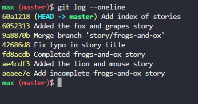

# Git CLI Commands and Lab Notes


## ✅ Git Basics

```bash

git init                  # Initialize a Git repo

git status                # Show current changes

git add filename          # Stage file

git commit -m "msg"       # Commit changes

```


## 🌐 Remote Repository

```bash

git remote add origin <url>  # Add remote

git push origin main         # Push to remote

git pull origin main         # Pull from remote

git clone <url>              # Clone a remote repo

```


## 🌱 Branching and Merging

```bash

git branch feature-1         # Create a branch

git checkout feature-1       # Switch to it

git merge main               # Merge main into current branch

git merge --no-ff feature-1  # Merge with no fast-forward

```


## ⚔️ Merge Conflicts

```txt

<<<<<<< HEAD

your code

=======

incoming code

>>>>>>> branch-name

```

Use git add <file> and git merge --continue after resolving.


## 🧠 Useful Git Tools

```bash

git stash             # Save current changes temporarily

git stash pop         # Reapply saved changes

git cherry-pick <commit>   # Apply a specific commit

git revert <commit>        # Safely undo a commit

git reset --hard <commit>  # Force reset (DANGER!)

git reflog                 # See all actions, even resets

```


## 🔍 Git Internals

```bash

git hash-object filename     # Get SHA-1 hash

git cat-file -p <hash>       # View Git object content

```

## 🔹 git log --oneline

This command shows a simplified view of the commit history.

```bash
git log --oneline
```
 


