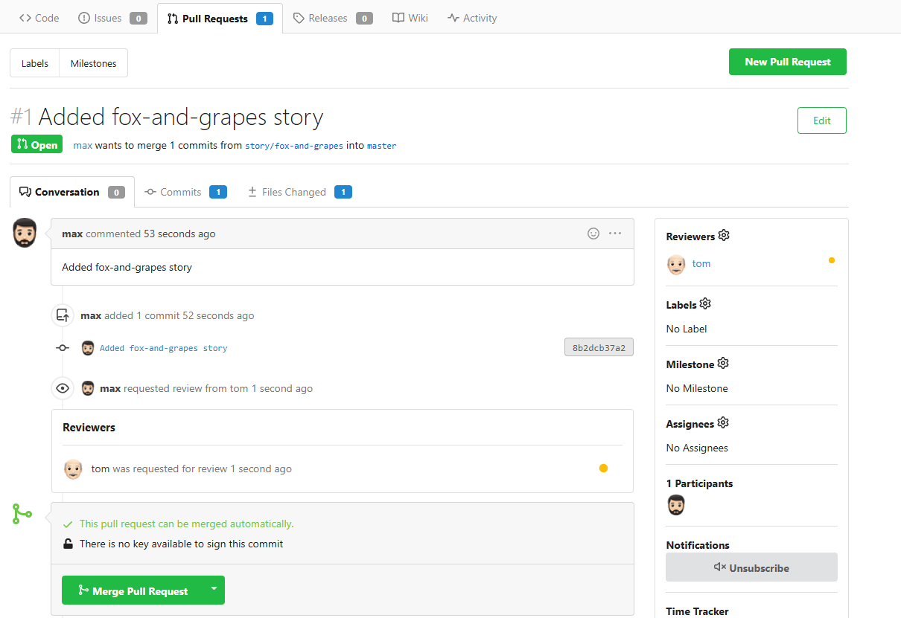
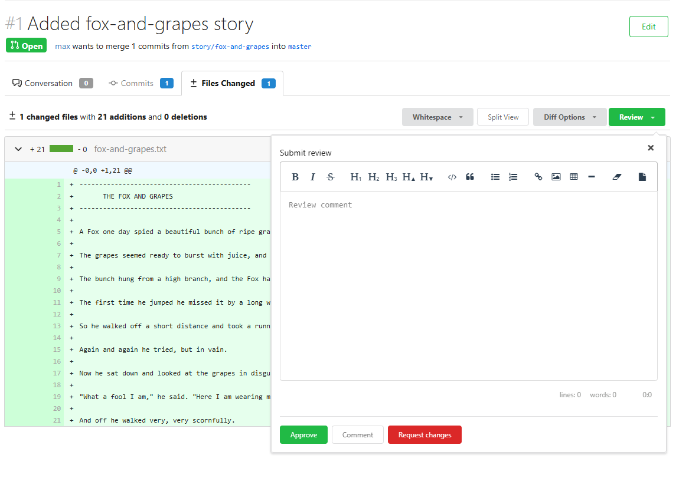
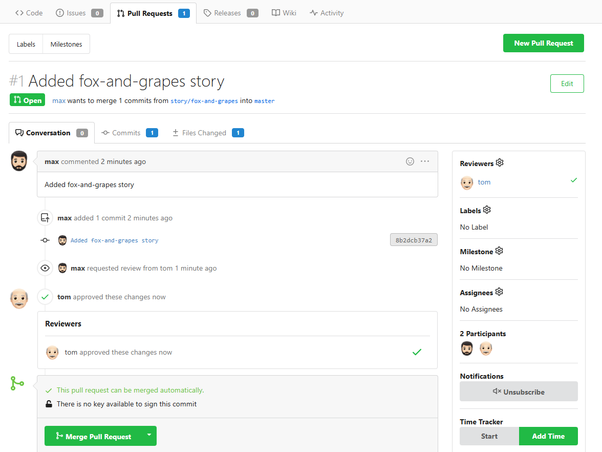
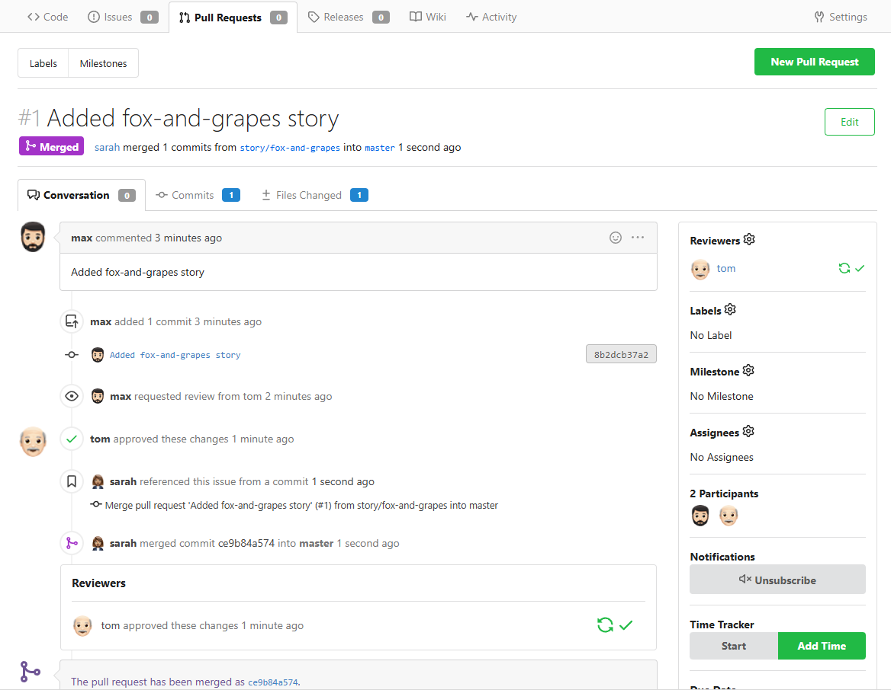

# GitHub Pull Request Workflow Demo

This series of screenshots demonstrates a real-world GitHub collaboration scenario using Pull Requests, reviewers, and approvals.

---

### 1. PR Created by Max

Max created a pull request from the branch `story/fox-and-grapes`.

---

### 2. Tom Reviewing the PR

The reviewer Tom opens the pull request and begins reviewing it.

---

### 3. Tom Approved the PR

Tom approves the changes after reviewing the code.

---

### 4. PR Merged by Sarah

Sarah, the repo owner, merges the PR into the main branch.

---

### 💡 What I Learned

- How to create and push a feature branch
- How to open a pull request on GitHub
- Role of reviewers and approvals
- Final merge by repo owner